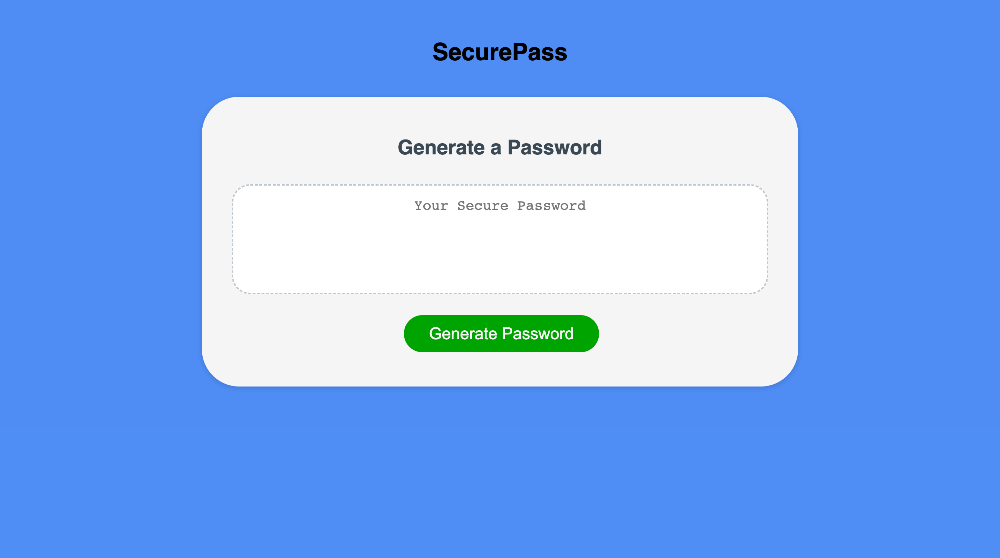

# Franks-password-generator
SecurePass - password Generator
#This password generator is designed to make a random password for employees to securely satisfy their possible criteria.  Its prompts the user to first choose how long they what their password at then the following criteria for the password uppercase, lowercase, numbers or special characters.

##Table of content:
-Mock up image with link below it
-Built with..
-Attributes and Acknowledgments
-licenses

##Mock up image of Secure pass and link below

https://oronafrankie87.github.io./SecurePass/

##Built with,
This pave was built using HTML CSS and JavaScript

Attributes and Acknowledgements,
Starter code was given via the UT Austin bootcamp and crafted by me(Francisco Orona) with the help of curriculum from Fullstack coding bootcamp and from W3schools.  Advice with the Javascript code was also taken from bootcamp TAs and tutors.

#Licence

MIT License